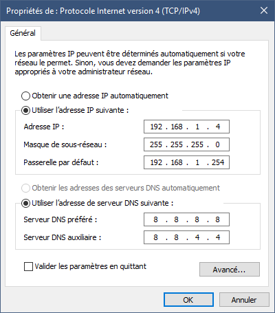

Distribution Sega Racer 2022-2024 - njz3

FOR ENGLISH TRANSLATION, PLEASE USE https://www.deepl.com/ or https://translate.google.com/

# A propos

Cette image disque est basée sur un Windows 10 entreprise dont la configuration
a été adaptée aux racecabs.
Elle propose un Hyperspin basé sur Maximum Car de HFS Play, avec la plupart des
jeux et emulateurs pré-configurés pour être jouables immédiatement en mode 
retour de force.
Les dernières versions des émulateurs sont utilisés, en particulier :
- MAME pour les jeux anciens, ou ceux des générations 90/2000 de Namco ou Taito par exemple.
- Nebula model 2 pour Sega Model 2
- Supermodel pour Sega Model 3
- Fycast pour Naomi 1/2 et Atomiswave
- Demul pour les jeux Gaelco ou Hikaru
- Dolphin pour les jeux Triforce
- Teknoparrot pour les jeux sur plateforme PC

Le retour de force est soit natif à la plateforme ou à l'émulateur (model2,
supermodel), soit généré par le FFB plugin de Boomslangnz. Il a été réglé dans
le BackForceFeeder afin de restituer au plus juste les effets originaux quand
c'est possible.
Le mapping des boutons et des axes par défaut est actuellement celui de ma 
borne Le Mans à savoir 1 volant, 2 pédales, 1 Start, 2 view buttons, 1 shifter
Up/Down.
Je laisse à chacun le soin de refaire le mapping selon sa borne via mon soft
BackforceFeeder en suivant le nommage déjà pré-établi pour les boutons de 
chaque jeu. Il y a des exemples de ControlSets disponibles dans le dossier 
```Documents\BackForceFeeder\ControlSets-XXX```

La distribution fonctionne en mode FullHD (1920x1080) sur l'ensemble des jeux. 
En se limitant aux jeux MAME, model 1/2/3 et Flycast (Naomi) la distribution
peut fonctionner en 24 kHz à l'aide du videoamp en 1024x768i ou 1024x384p, ou
en 15 kHz avec le videoamp en mode 1280x240p ou 1280x480i (image étirée).


# Configuration Hardware

> **IMPORTANT**
> Au premier démarrage, laisser le temps à Windows de démarrer puis installer
> vos drivers.

Si vous pouvez connecter votre PC à internet, faites Windows Update pour
récupérer vos drivers automatiquement.
Le SSD est prévu pour fonctionner sur un PC avec :
- un processeur intel 4th gen (ou plus récent), ou un AMD Ryzen.
- 4GB de RAM minimum
- une carte graphique type Nvidia 1030 ou plus récent (1050Ti recommandé)
- une souris ou un clavier USB branché en permanence (ceci afin de pouvoir
utiliser la fonction d'émulation de clavier DInput)
- soit un moniteur LCD FullHD pour profiter de l'ensemble des jeux, soit un 
moniteur CRT supportant le 1024x768 (31kHz ou 24kHz entrelacé) pour pratiquement
tous les jeux hors jeux Teknoparrot HD. 
Une edition spécifique 15kHz en 1280x240p ou 1280x480i en mode "stretch" est 
possible avec moins de jeux (uniquement MAME, model 1/2/3 et Naomi via Flycast).


# Configuration Windows

## Reseau

IP: 192.168.1.4 pour cabine 1 (ou 192.168.1.5 ou .6, .7, .. selon la cabine en multi)
Masque de sous-réseau: 255.255.255.0
Passerelle : 192.168.1.254 (modifable selon votre réseau LAN en 192.168.1.1)
DNS : 8.8.8.8 ou 8.8.4.4 (DNS de Google)
Broadcast address: 192.168.1.255

Mettre réseau privé et désactiver le Firewall.

> **Note:**
Pour le jeu en réseau sur model 2 emulator (Sega Rally, Daytona 1, etc.)
if faut impérativement activer le support des trames de longues taille (3kB)
soit via une option de votre carte réseau, soit activer l'option "Jumbo Frames"
dans votre carte Ethernet (MTU >3kB) et avoir un switch Ethernet 1GBit qui 
supporte les "Jumbo Frames".

.

## Softs pré-installés

Le chemin C:\Racecab\Utils est ajouté dans la variable d'environement PATH du système.
Sont pré-installés :
- Les redistribuables VC Runtime Visual C++ (x86 et x64) en version 2010 (vcr100), 2012 (vcr110), 2013 (vcr120), 2015-2022 (vcr140).
- Dans les composants Windows (ajout/suppresion de composants) : DirectX (ajout composants graphiques windows), DirectPlay (ajout legacy componants/DirectPlay), Lecteur Multimedia
- La font BebasNeue.ttf pour RocketLauncher
- Les utilitaires comme VLC, TightVNC, WinMerge, Putty, Teamviewer, Firefox.
- vJoy (3 axes, 32 boutons, tous effects actifs), BFF
- Si vous voulez passer en mode TESTSIGN ON (pour vjoy non signé sous Windows 11 par exemple), utiliser Universal Watermark Disabler
- dk2win3264_8.22.26.exe (driver dongle de licence) pour avoir le mode test dans le jeu Sega Racing Classic
- rapture3dgame_2.7.4_win.exe (driver son 3D) pour Sega Showdown
- wmv9VCMsetup.exe (decoder VM9 pour windows media player) pour Storm Racer G


## Mots de passe et prise en main à distance

Par défaut, Teamviewer et TightVNC (mode serveur) sont préinstallés.
Le mot de passe de session pour l'utilisateur Racecab (admin) est `racecab`
Le mot de passe pour Teamviewer est `Racecab22!`
Le mot de passe pour VNC est `racecab`


## Démarrage automatique d'un jeu

Par défaut, deux raccourcis (hyperspin.exe et BackforceFeeder.exe) sont
installés dans le répertoire de démarrage automatique: 
```C:\Users\Racecab\AppData\Roaming\Microsoft\Windows\Start Menu\Programs\Startup```

Si vous souhaitez ne pas faire démarrer automatiquement Hyperspin, mais un jeu
en particulier, vous devez supprimer le raccourci vers Hyperspin, et en créer
un autre vers l'émulateur ou le jeu que vous souhaitez lancer dès le démarrage.

## FFB dans les émulateurs

En cas de changement ou de ré-installation de vjoy, re mettre vJoy en volant 
à retour de force via le plugin FFB dans :
```
C:\Racecab\Emulators\Demul_07a_[180428]_Gaelco
C:\Racecab\Emulators\Demul_07a_[180428]_Gaelco_SD
C:\Racecab\Emulators\Demul_07a_[180428]_Hikaru
C:\Racecab\Emulators\Flycast
C:\Racecab\Emulators\Flycast LINK
C:\Racecab\Emulators\Mame
C:\Racecab\Emulators\Mame LINK
C:\Racecab\Emulators\Model2 v1.1a
C:\Racecab\Emulators\Model2 v1.1a LINK
C:\Racecab\Emulators\Supermodel
C:\Racecab\Emulators\Supermodel LINK
```

Teknoparrot:
```
C:\Racecab\Games\Batman - Raw Thrills PC Based\ZeusSP
C:\Racecab\Games\Battle Gear 4 Tuned 2.8 - Taito Type X +
C:\Racecab\Games\Battle Gear 4 Tuned 2.8 Professional Edition - Taito Type X +
C:\Racecab\Games\Chase H.Q. 2 - Taito Type X 2
C:\Racecab\Games\Daytona Championship USA\Sega\Daytona
C:\Racecab\Games\Daytona Championship USA New Season Edition\Sega\Daytona
C:\Racecab\Games\Dirty Drivin - Raw Thrills PC Based
C:\Racecab\Games\Ford Racing Full Blown - SEGA Arcade PC Based\FordRacing
C:\Racecab\Games\GTI Club Super Mini Fiesta - Konami PC Based
C:\Racecab\Games\H2 Overdrive - Raw Thrills PC based
C:\Racecab\Games\Initial D 4 - SEGA Lindbergh
C:\Racecab\Games\Initial D 4 Export (Fr Traduction) - SEGA Lindbergh
C:\Racecab\Games\Initial D 5 Export - SEGA Lindbergh
C:\Racecab\Games\Initial D 6 AA - SEGA Ringedge
C:\Racecab\Games\Initial D 7 AAX - SEGA Ringedge
C:\Racecab\Games\Initial D 8 Infinity - SEGA Ringedge
C:\Racecab\Games\Initial D Arcade Stage Zero v.2.30 - SEGA NU
C:\Racecab\Games\Mario Kart Arcade GP DX (V1.10 - Mod FR 1h) - Namco ES3
C:\Racecab\Games\Outrun 2 SP SDX - SEGA Lindbergh\disk0\Jennifer
C:\Racecab\Games\R-Tuned Ultimate Street Racing - SEGA Lindbergh
```
Attention pour les jeux Lindbergh comme Outrun2, il faut en plus copier les dll `opengl32.dll`
et `SDL2.dll` dans `C:\Racecab\Emulators\Teknoparrot\TeknoParrot`

Lancer MAME, vérifier qu'un jeu se lance.
Lancer Teknoparrot, vérifier qu'un jeu se lance.


# Changement de configurations vidéo

L'image standard contient des configurations d'émulateurs pour fonctionner
en mode FullHD 1080 et il est nécessaire de les changer pour changer de mode
vidéo. Des scripts SetXXX.bat sont présents dans le répertoire `Utils\` pour
réaliser la copie des fichiers de configuration vidéo des émulateurs
automatiquement.

.

Liste des résolutions:

- FullHD 1080p/i

Tous les jeux fonctionnent en Full HD.


- CRT 1280x960p/i (moniteur PC ou Videoamp 31Hz entrelacé sur VGA natif)
- CRT 1024x768p/i (moniteur PC ou Videoamp 24Hz entrelacé sur VGA natif)

Tous les jeux sauf certains Teknoparrot qui ne supportent que la HD 16/9e.


- CRT 640x480p (Videoamp 31Hz progressif)
- CRT 1024x384p (Videoamp 24Hz progressif strech)
- CRT 512x384p (Videoamp 24Hz progressif en activant GPU scaling)
- CRT 1280x240p (Videoamp 15Hz progressif strech)
- CRT 640x480i (Videoamp 15Hz entrelacé sur VGA natif)
- CRT 1280x480i (Videoamp 15Hz entrelacé strech sur VGA natif)
- CRT 320x240p (Videoamp 15Hz progressif en activant GPU scaling)

Seuls les jeux : MAME, model 2, model 3 et Naomi (Flycast) fonctionnent.

## Utiliser des basses résolutions en utilisant le GPU Scaling sur le VideoAmp

Exemple : sortir du 512x384p en utilisant le VideoAmp sur une carte NVidia 
1050Ti.
1. Configurer le VideoAmp avec 2 résolutions : la (P)referred en 1024x384p,
la suivante en supplémentaire 512x384p avec exactement le même timing vertical
(même valeur en vertical dans la modeline).
2. Brancher le VideoAmp qui va etre détecter comme écran 1024x384p
3. Aller dans le NVidia "Control Panel", ou Intel ou AMD, et dans la page 
"Régler la taille et la position", activer le plein écran ou le mode Stretch.
4. Dans les propriétés d'affichage de Windows, sélectionner la résolution
512x384p, et vous aurez automatiquement un plein écran avec scaling par GPU.


# Pour ajouter un jeu 1P


## Stockage du jeu

Mettre le jeu dans un dossier sous `C:\Racecab\Games` (si natif windows ou 
teknoparrot) ou directement dans `C:\Racecab\Emulators\XXX\roms` pour une
rom ou jeu émulé par XXX.


## Batch de lancement

Comme pratiquement chaque jeu a une configuration propre pour le FFB ou les
boutons, il est conseillé de faire un fichier .bat pour chaque jeu, qui sera
placé dans le dossier du jeu ou de l'émulateur qui va le lancer.

Nommer votre fichier .bat de manière unique et identifiable facilement. Si 
possible, prendre un nom sans espace et qui correspont à un nom de rom unique.
Par exemple : "daytonas.bat" dans le dossier de `C:\Racecab\Emulators\Model2 v1.1a`
(rom "daytonas" pour le jeu Daytona Saturn Ads).

Au besoin, placez les arguments dont vous avez besoin dans le .bat.
Des utilitaires dans `C:\Racecab\Utils` vous permettent de faire des actions de
bases, comme lancer un emulateur, appuyer sur une touche, tuer un process,
changer de résolution, etc.
En particulier, je recommande de mettre la fenetre en mode "minimized" dès le
lancement et de donner un titre de fenetre (via la commande `TITLE`) qui soit
unique pour le jeu, afin que le BackForceFeeder puisse identifier quel jeu est
lancé.

Vérifier à la main que le jeu se lance via votre .bat.


## Configuration Hyperspin et RocketLauncher

- Mettre une image ronde dans le dossier 
`C:\Racecab\Hyperspin\Media\1P\images\artwork4`
avec exactement le nom de votre .bat (exemple : `daytonas.png`)

- Mettre l'image de titre (max 400 pixels de large) dans le dossier
`C:\Racecab\Hyperspin\Media\1P\images\wheel`
avec exactement le nom de votre .bat (exemple : `daytonas.png`)

- Mettre la video au format mp4 ou flv dans le dossier 
`C:\Racecab\Hyperspin\Media\1P\video`
avec exactement le nom de votre .bat (exemple : `daytonas.mp4`)

- Ajouter les balises xml dans la database Hyperspin qui est dans le fichier
`C:\Racecab\Hyperspin\Databases\1P\1P.xml`
en prenant exactement le nom de votre .bat pour la balise `name`.

Par exemple :
```
<game name="daytonas" index="true" image="c">
	<description>Daytona USA (Saturn Ads)</description>
	<cloneof></cloneof>
	<crc></crc>
	<manufacturer>Sega, *FFB*</manufacturer>
	<year>1993</year>
	<genre></genre>
</game>
```
- Copier le fichier 1P.xml de la database Hyperspin vers la database
RocketLauncherUI
`C:\Racecab\Hyperspin\RocketLauncher\RocketLauncherUI\Databases\1P\1P.xml`

- Declarer quel emulateur et systeme utiliser pour votre jeu. A part pour les
jeux MAME, nous n'utiliserons que le module PCLauncher (lancement de fichiers 
.exe ou .bat). Ainsi, ajouter les balises pour votre jeu dans le fichier
`C:\Racecab\Hyperspin\RocketLauncher\Settings\1P\Games.ini`

Par exemple : 
```
[daytonas]
Emulator=PCLauncher
System=1P
```
- Ajouter la ligne qui permet de lancer votre .bat et les options de lancement
via le module PCLauncher.ahk dans le fichier 
`C:\Racecab\Hyperspin\RocketLauncher\Modules\PCLauncher\1P.ini`

Par exemple:

```
[daytonas]
Application=..\..\Emulators\Model2 v1.1a\Emulator_multicpu.exe
Parameters=daytonas
AppWaitExe=Emulator_multicpu.exe
```
Les options du module PCLauncher de RocketLauncher sont données en entête de
fichier dans la balise [Example].

> **ATTENTION**
pour temporairement enlever un jeu dans le fichier, il faut mettre des '#' au
début de ligne dans `C:\Racecab\Hyperspin\RocketLauncher\Modules\PCLauncher\1P.ini`
et surtout supprimer les [] autour du nom du jeu, sinon RocketLauncher va
quand même le détecter. 

Par exemple, pour commenter daytonas, mettre :
```
# daytonas                       <= sans les []
#Application=..\..\Emulators\Model2 v1.1a\Emulator_multicpu.exe
#Parameters=daytona
#AppWaitExe=Emulator_multicpu.exe
```


Une fois configuré, tester si votre jeu se lancer via RocketLauncher. Démarrer
`C:\Racecab\Hyperspin\RocketLauncher\RocketLauncher.exe`
Puis prendre le system 1P et taper le nom de votre jeu (par exemple 'daytonas').

Lancer Hyperspin et faire la même chose en testant si votre jeu se lance.

Pour vous aider à trouver les bons fichiers ou les bons répertoires, vous pouvez
lancer le script `C:\Racecab\Utils\edit1Pfiles.Bat`

## Configuration BackForceFeeder

Ajouter un nouveau control set en duplicant un existant.

Pour automatiquement détecter le jeu dans le BFF, préciser soit le nom de 
l'exécutable et le titre de la fenetre principale, soit dans le fichier .bat 
ajouter un TITLE avec un titre unique ou le nom du fichier .bat. Dans ce cas,
dans le BFF, indiquer `conhost|cmd` dans l'exe, et en nom de fenetre ce que 
vous avez mis en TITLE de votre .bat (en général nom du fichier .bat).

Lancer le jeu via le .bat et verifier que le BFF bascule vers le control set
(vous devez avoir coché l'autodetection dans App&Hardware pour que cela marche).


# Pour ajouter un jeu MULTI

Procéder exactement comme en 1P mais utiliser les noms de dossiers MULTI, et
les fichiers MULTI.ini.

Penser à faire un .bat different si besoin pour distinguer le 1P du MULTI.

En résumé :

1) Ajouter les images et video dans (avec un nom unique): 
`C:\Racecab\Hyperspin\Media\MULTI`

2) Editer la database Hyperspin (fichier xml) ici :
`C:\Racecab\Hyperspin\Databases\MULTI\MULTI.xml`

3) Copier la databse Hyperspin (fichier xml) vers celle de RocketLauncherUI :
`C:\Racecab\Hyperspin\RocketLauncher\RocketLauncherUI\Databases\MULTI`

4) Ajouter la decription de votre jeu (emulateur et system) dans :
`C:\Racecab\Hyperspin\RocketLauncher\Settings\MULTI\Games.ini`

5) Mettre la commande de lancement de votre jeu dans :
`C:\Racecab\Hyperspin\RocketLauncher\Modules\PCLauncher\MULTI.ini`

6) Si besoin, configurer le BFF pour détecter votre .bat ou votre jeu et 
configurer les controles, les lampes ou le retour de force.

Pour vous aider à trouver les bons fichiers ou les bons répertoires, vous pouvez
lancer le script `C:\Racecab\Utils\editMULTIfiles.Bat`


# Modifier/ré-ordonner la liste de jeux sur Hyperspin

Si vous souhaitez réorganiser ou cacher des jeux, vous devez éditer le fichier
de base de données XML de Hyperspin.
Le plus simple est de lancer le script dans "C:\Racecab\Utils\edit1Pfiles.bat"
qui ouvrira tous les répertoires et fichiers utilisés pour le mode 1P par 
exemple (procédez de même pour le mode MULTI en lançant
"C:\Racecab\Utils\editMULTIfiles.bat").

Ensuite, vous commentez ou réordonnez manuellement les jeux dans le fichier
"C:\Racecab\Hyperspin\Databases\1P\1P.xml". 2 fichiers seront ouverts pour
l'édition à l'aide du script, celui que vous devez modifier est situé dans
"C:\Racecab\Hyperspin\Databases\1P".
Veuillez faire une sauvegarde du fichier avant l'édition, afin de pouvoir
revenir en arrière.


# Configuration du BackForceFeeder

Le logiciel BackForceFeeder est pré-installé et possède une configuration par
défaut pour la plupart des jeux en mode shifter Up/Down et 2x View Buttons.

Le logiciel nécessite un fichier `licence.dat` pour être activé, qui est fourni
sur demande par email à `bff.register@gmail.com` en indiquant votre ID de
machine et en joignant un don paypal à la même adresse email (un minimum de 20€
par machine est demandé).

Le fichier de licence est à placer dans le répertoire :
`C:\Users\Racecab\Documents\BackForceFeeder`

## Fichiers de configuration

Les configurations sont stockées dans le répertoire :
`C:\Users\Racecab\Documents\BackForceFeeder`

Le sous-dossier ControlSets contient en particulier les configurations pour
chaque jeu. Vous ne pouvez pas éditer à la main ces fichiers si le logiciel
fonctionne, il faut d'abord le fermer pour pouvoir modifier les fichiers.

## Configuration de vos boutons/axes

Pour configurer les contrôles pour votre propre panel/cablage, le mieux est 
de ne changer que le mapping des boutons par type d'émulateur (MAME, Model 2,
Supermodel, TP), puis d'utiliser la page "Explorer" de ControlSet pour 
copier-coller uniquement le mapping des entrées brutes, et/ou le calibrage 
des axes vers plusieurs ControlSets simultanément.

Des ensembles de jeux de paramètres ont été créés pour différents panels.
Le dossier `C:\Users\Racecab\Documents\BackForceFeeder\` contient plusieurs
sous dossiers dont le nom commence par `ControlSets-XXX`.
Après avoir éteint le BackForceFeeder, vous pouvez effacer le dossier ControlSets-XXX`
et le remplacer par un autre dossier qui correspond à votre panel.
Vous pouvez ensuite relancer le BackForceFeeder et faire le calibrage des axes
sur l'ensemble de paramètres `Default` et le dupliquer sur tous les autres ensemble
de paramètres.

# Problèmes connus - Troubleshooting

## Servoboard Sega avec adaptateur midi ou RS

Si l'initialization ne se déroule pas correctement, vérifier dans un premier temps 
que la LED rouge pret du connecteur CN2 s'allume et clignote toutes les 3 secondes
quand la carte est alimentée en 100VAC.

Les servoboard Sega indiquent par un code de clignotement certaines erreurs. Par
exemple, si le codeur n'est pas correctement branché, un clignotement d'environ 1 seconde
va être réalisé.

Quand l'initalization se déroule correctement, la LED rouge va rester allumée en permanence.

# Notes - FAQ

## Jeux Model 2 en mode Link

Pour avoir un bon fonctionnement en mode Link (MULTI) il est obligatoire
d'avoir un switch 1Gbs et d'activer le mode "Jumbo Frame", voir au début
de ce document.
La touche pour quitter l'émulateur est Alt+F4.

## Jeux Model 3

Supermodel permet d'utiliser un shifter Up/Down pour les jeux à 4 vitesses,
ainsi il n'est pas nécessaire d'activer une émulation de séquence pour émuler
un shifter H4 depuis un Up/Down. Les paramètres sont "InputGearShiftUp" et
"InputGearShiftDown". Mais il reste tout à fait possible d'utiliser une
séquence ou directement un shifter H4 via le decodeur du BFF.

## Jeux Teknoparrot

### Outrun2 et autres jeux Lindberg

Prévoir de copier les fichiers EPROM single/multi dans `C:\Users\Racecab\AppData\Roaming\TeknoParrot`

### Raw Thrills PC Based

La plupart des jeux Raw Thrills necessite d'etre à la racine de `C:\` dans un
repertoire commencant par `rawart`, par exemple: 
- `Fast n Furious serie` dans `C:\rawart FnF\`
- `Winter X Games Snocross` obligatoirement dans `C:\rawart Winter X Games Snocross\` sinon image qui fait du flickering.
- `SuperBikes` obligatoirement dans `C:\rawart SuperBikes\` sinon erreur CRC
- `SuperBikes 2` obligatoirement dans `C:\rawart SuperBikes2\` sinon erreur CRC

### Daytona USA Championship 3 (TP)

Le jeu ne fonctionnera en multi __*que si une webcam FullHD USB compatible avec le jeu*__ est branchée.
Certaines webcam Logitech sont compatibles.

Il est important de respecter une adresse IP en 192.168.1.X dont le dernier
chiffre X est en dessous de 10 (exemple: X=4, X=5, X=6, X=7).
Fichiers à modifier : 
- ShellData\ShellData.ini : dans [Network], mettre Enabled=1, CabinetID=1 (ou 2, 3, 4), NumCabinets=2 (ou 4)
- Shell\Game.ini : dans [Network], mettre CabinetDomain=192.168.1 et CabinetBaseAddr=X (avec X=4 ou 5, 6, 7 selon votre IP)

Pour le Service menu (shell): 
- déplacer le jeu à la racine C:\Sega
- installer driver DK2
- désactiver sortie son HDMI et activer sortie son analogique
- lancer C:\Sega/shell/shell.exe
- appuyer sur la touche T (pour test), et la touche Y pour service

### Sega Rally 3 - Autres Editions (courses issues de la version PC)

Les Editions Artic, Alpines, etc. utilisent les circuits de la version PC mais
ne marchent qu'en mode Quick Race (single ou multijoueur) et non en mode 
championnat. Le mode championnat ne marche qu'avec la version arcade originale.


# Change log

---
2025-04-22:
- Update BFF to 0.8.0.49 (support for Sega Servoboard). Update Teknoparrot 1.0.0.1606, Supermodel 2025-04-22, flycast master 2025-04-15.

---
2024-11-28:
- Update Teknoparrot
- Fix OutRun2 SP DX not working with latest Teknoparrot
- Add files for 3840x2160 resolution
- Fix WackyRace brake pedal
- Removed directories for Supermodel with FFB plugin
- Add CrazyRide (1P)

---
2024-11-08:
- Update BFF 0.7.0.159, MAME 0.271 (no nag), MAME FFB plugin, Supermodel
- Fix flycast FFB: removed FFB plugin

---
2024-08-09:
- Update BFF 0.7.0.144, TP 1340, MAME 0.268 (no nag), MAME FFB plugin, Supermodel
- Add Wasteland Racers

---
2024-06-14:
- Update BFF 0.7.0.135, TP 1269, MAME 0.266 (no nag), MAME FFB plugin, Supermodel
- Update Demul for Hikaru (Nascar and SWPR)

---
2024-05-02:
- Update BFF 0.7.0.129, TP 1250, MAME 0.265
- Fix MKDX/WMMT6/IDZv2TP not exiting with Start+VR1 due to being launched as administrator (not required anymore)
- Fix KO Drive
- Fix Flycast stretch not working for F355 as it uses the parameters in emu.cfg file (copy files when video is configured)
- Add Win10 English language pack

---
2024-04-05:
- Fix Initial D Zero v2.30
- Add TP Serial (ex Patreon) games

---
2024-03-19:
- add more games for 1024x384p (DJ Goliath)
- update BFF and Videoamp
- add raverace to Multi
- add _nativeFFB
- fix FFB Plugin opengl32.dll for supermodel

---
2024-03-08:
- fix Daytona USA 3/NSE Link mode
- fix MAME nvram for Link mode for f1lap, radr, orunner
- add m2lagfix for Model 2 Link mode

---
2024-02-02:
- fix OR2 force feedback
- add scripts in Utils/ to easily change all configurations options for CRT or LCD mode

---
2024-01-04:
- fix disk structure for Raw Thrills Games (rawart)
